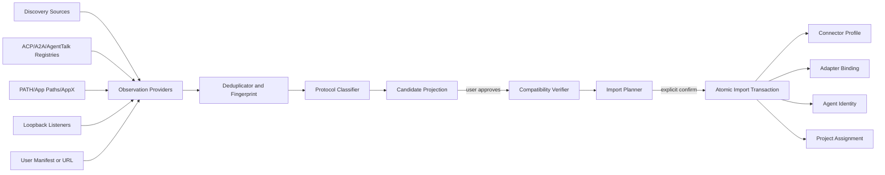
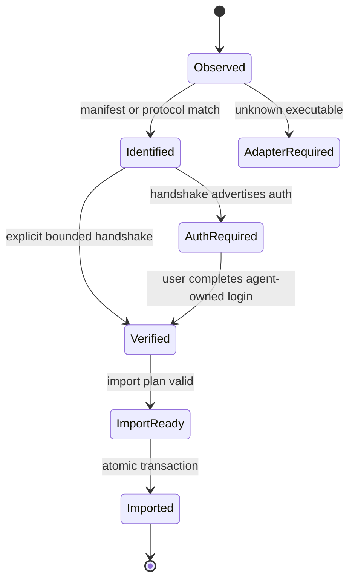
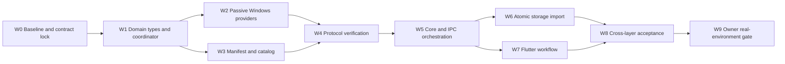

# AgentTalk 通用本地智能体发现与导入设计

状态：设计候选（Design Candidate）
日期：2026-08-11
适用代码基线：`codex/flutter-ui-discovery-integration-v1` / `5dfade3146973bfd6ac0cea9f055908fbbb9e184`

## 1. 结论

AgentTalk 不能通过“扫描所有 EXE”自动理解任意本地智能体。一个未知程序的存在只证明它可能是候选，无法证明：

- 它是不是智能体，而不是模型 Runtime、MCP 工具服务器或普通应用；
- 应该如何启动、握手、认证、发送消息、取消任务；
- 它支持哪些模型、工作区权限、流式事件和恢复语义；
- 它是否值得信任，以及启动后是否会修改用户环境。

因此，正确方案不是继续增加 Codex、Kun、Claude、Gemini 等产品名分支，而是建立四层机制：

1. **被动发现（Observation）**：从操作系统、注册清单和现有 loopback listener 获取证据，不启动程序。
2. **协议识别（Classification）**：把候选分为 Agent Protocol、Model Runtime、Tool Server 或 Unknown。
3. **显式验证（Verification）**：用户同意后，按 ACP/A2A/OpenAI-compatible/Ollama 等已知协议执行有界握手；不发送 prompt/turn。
4. **原子导入（Import）**：一次事务创建 Connector、Adapter Binding、Agent Identity、模型选择和 Project Assignment；任一步失败全部回滚。

ACP（Agent Client Protocol）应成为本地编码智能体的首选协议。A2A 用于已有 HTTP endpoint 的智能体，OpenAI-compatible/Ollama/LM Studio 只作为模型 Runtime，MCP 只作为工具服务器。未知 CLI 必须由受控 manifest 指明协议和启动方式，否则只能显示“发现但暂不兼容”。

## 2. 当前实现为什么只能找到 Codex 和 Kun

当前源码不是通用扫描器：

- `runtime_host/src/lib.rs` 中 `LocalConnectorDiscoveryConfig` 只有 Codex binary、Kun dataDir/installDir；production 扫描函数只执行这两个探针。
- `agent.scan_local` 在 Core 中只是 `connector.discover` 的展示别名，两者返回完全相同的数据。
- `LocalDiscoveryEntry` 只有八个字段，没有协议、传输、能力、证据、信任、验证阶段或 adapter manifest。
- Runtime Registry 启动时只注册固定的 `unconfigured`、`codex`、`kun`、`openai-compatible`、`http-custom` 类型。SQLite 中创建一个未知 runtime type 的 Connector Profile，并不会得到可执行 adapter。
- Flutter 选择候选后直接执行“创建身份 -> 绑定模型 -> 加入项目”三个独立命令，不是一个原子导入事务。

用户手测还证明了两个具体缺陷：

- Codex 只从 EXE 被识别，没有协议握手和模型目录，因此 UI 要求必填模型时会陷入“发现了但无法可靠导入”。
- Kun discovery source 显示实际版本为 `0.2.37`，而扫描器当前固定期待 `0.2.34`。新版本会被误判不可用。身份校验应基于协议版本、build identity 和能力协商，而不是单个产品版本常量。

## 3. 名词与分类

| 类别 | 定义 | 示例协议 | 在 AgentTalk 中的归宿 |
|---|---|---|---|
| Agent Protocol | 有会话、prompt、流式输出、取消、权限和任务生命周期 | ACP、A2A | 可导入为 Connector，再创建 Agent Identity |
| Model Runtime | 提供模型推理和模型目录，但没有完整 Agent 生命周期 | OpenAI-compatible、Ollama、LM Studio | 导入为模型 Connector；由用户另外创建 Agent Identity |
| Tool Server | 向 AI Host 提供 tools/resources/prompts | MCP | 导入工具中心，不进入 Agent roster |
| Unknown Candidate | 只有 EXE、安装包或 listener 证据，协议未知 | 任意 CLI/桌面程序 | 展示为“需要适配器”，不能直接使用 |

“已安装”“正在运行”“协议兼容”“认证完成”“可执行”必须是不同状态，禁止再用一个 `available/unavailable` 代替全部含义。

## 4. 总体架构



建议新增以下 Core 组件：

```text
DiscoveryCoordinator
  ├─ ObservationProvider[]
  ├─ CandidateDeduplicator
  ├─ ProtocolClassifier
  ├─ CompatibilityVerifier[]
  ├─ AdapterCatalog
  ├─ ImportPlanner
  └─ ImportTransactionService
```

产品特定知识只允许出现在声明式 manifest 或独立 adapter 包中，禁止继续进入 `discover_local_connectors_with_config()` 主流程。

## 5. 发现来源

### 5.1 默认启用：纯被动来源

#### A. AgentTalk 本地 manifest

支持用户或应用供应商提供 `agenttalk-agent.json`。来源可以是：

- 用户从文件选择器显式导入；
- `%LOCALAPPDATA%\AgentTalk\adapters\` 下由用户批准安装的 manifest；
- 应用目录旁的 manifest，但只有 executable 已通过 OS inventory 找到后才读取；
- 未来的 `agenttalk://register` 注册流程，必须弹窗确认。

不得递归搜索磁盘寻找 manifest。

#### B. ACP Registry inventory

ACP Registry 已提供跨平台 binary、`npx`、`uvx` distribution，以及命令、参数、环境变量和可选 SHA-256。AgentTalk 应缓存经过 schema 校验的 registry metadata，并用它匹配本机 inventory。

Registry 用于回答“这个程序若存在，如何以 ACP 启动”，不是授权 AgentTalk自动下载或运行。安装和首次启动始终需要用户确认。

普通“扫描本地智能体”只消费随版本附带或此前显式刷新过的本地缓存，不在扫描过程中联网。Registry 刷新必须是单独的用户动作，显示来源与更新时间；网络失败不能阻止离线 inventory 扫描。

#### C. Windows executable inventory

只读取以下有界来源：

- 当前进程 PATH；
- HKCU/HKLM `...\App Paths`；
- MSIX/AppX `PackageManager.FindPackagesForUser`；
- 用户明确选择的 executable；
- 可选的 package-manager inventory（`npm -g`、`uv tool`、`pipx`、`winget list`），默认关闭且不得触发联网更新。

这些来源只生成 executable observation，不能直接生成“可用智能体”。

#### D. 已运行的 loopback listener

Windows 使用 `GetExtendedTcpTable` / owner PID 只枚举当前已监听端口，然后读取进程的可执行文件身份。禁止扫描 `1..65535` 端口。

对 listener 只允许：

- `127.0.0.0/8`、`::1`；
- 不经系统代理；
- 不跟随重定向到非 loopback；
- 2 秒以内超时和严格 body 上限；
- 先尝试已声明的 identity endpoint，而不是向所有端口发送多个猜测请求。

### 5.2 用户选择后启用：主动来源

- 用户输入 A2A base URL，读取 `/.well-known/agent-card.json`；
- 用户选择 executable 和 adapter manifest；
- 用户选择 ACP Registry 条目并允许启动一次受限握手；
- 用户输入 OpenAI-compatible/Ollama/LM Studio endpoint；
- 用户选择 MCP config，但结果进入工具中心。

### 5.3 默认关闭：局域网发现

未来可通过 DNS-SD/mDNS 发现 `_a2a._tcp` 或 AgentTalk 自定义服务类型，但必须单独开关，并在 UI 说明设备名、主机名和服务属性可能被局域网看到。个人本机模式只扫描 loopback。

## 6. 禁止的发现方式

- 全盘递归查找 `*.exe`、配置目录或关键字；
- 暴力扫描全部 TCP/UDP 端口；
- 读取 `.env`、token、Authorization、Cookie 或第三方应用凭据正文；
- 为了“看看是不是智能体”而启动未知程序；
- 对未知 CLI 猜测 `--help`、`serve`、`app-server` 等参数；
- 扫描后静默创建 Connector、Agent 或 Project Assignment；
- 把 MCP server、模型 Runtime 或普通聊天 UI 自动当成 Agent；
- 把文件路径、PID、端口、build hash 原样显示在普通 UI。

## 7. 数据模型

### 7.1 Observation：Core 私有、短生命周期

```json
{
  "observationId": "obs-...",
  "sourceKind": "windows_app_path",
  "locatorKind": "executable",
  "locatorRef": "core-private-reference",
  "displayHint": "Example Agent",
  "fingerprint": {
    "fileSha256": "...",
    "publisher": "...",
    "productVersion": "..."
  },
  "observedAt": "..."
}
```

`locatorRef`、绝对路径、PID 和端口不进入 Renderer IPC。Observation 扫描结束后默认丢弃。

### 7.2 Candidate：可展示、不可直接执行

```json
{
  "candidateId": "candidate-...",
  "category": "agent_protocol",
  "displayName": "Example Agent",
  "protocol": { "kind": "acp", "versionRange": "1" },
  "transport": "stdio",
  "discoveryState": "identified",
  "compatibilityState": "not_verified",
  "trustState": "registry_matched",
  "adapterRef": "acp:registry/example-agent@1.2.0",
  "capabilities": [],
  "models": [],
  "requiresUserAction": "verify",
  "evidenceSummary": ["已安装", "匹配 ACP Registry"]
}
```

### 7.3 状态维度

Discovery、compatibility、auth、health 分开保存：

| 维度 | 值 |
|---|---|
| discovery | observed / identified / disappeared |
| compatibility | not_verified / compatible / incompatible / adapter_required |
| auth | unknown / not_required / required / ready |
| health | not_checked / ready / unavailable / identity_mismatch |
| import | not_planned / ready / imported / conflict |

UI 可以据此准确显示“已找到但需要适配器”“协议兼容但需要登录”“模型服务，不是智能体”等状态。

## 8. Adapter Manifest

AgentTalk 自有 manifest 只描述非秘密元数据：

```json
{
  "schemaVersion": "agenttalk.adapter.v1",
  "id": "org.example.agent",
  "displayName": "Example Agent",
  "category": "agent_protocol",
  "protocol": { "kind": "acp", "major": 1 },
  "match": {
    "executableNames": ["example-agent.exe"],
    "publisherSubjects": ["Example Corp"],
    "registryIds": ["example-agent"]
  },
  "launch": {
    "transport": "stdio",
    "executableRef": "matched-observation",
    "args": ["--acp"],
    "environmentAllowlist": ["PATH", "USERPROFILE", "LOCALAPPDATA"]
  },
  "verification": {
    "kind": "acp_initialize",
    "timeoutMs": 3000
  },
  "capabilityPolicy": {
    "filesystem": "negotiate",
    "shell": "negotiate",
    "streaming": "required",
    "cancel": "required"
  }
}
```

规则：

- 不允许 shell command string，只允许 executable + args 数组；
- 不允许在 manifest 内保存 secret value，只能声明 credential slot 或环境变量名；
- Registry manifest 必须经过 schema、平台、hash 和来源校验；
- Windows PE 可用 `WinVerifyTrust` 获取 Authenticode 信任结果，但“已签名”不等于“AgentTalk 已信任”；
- 第一阶段不加载第三方 DLL。Core 只内置协议 adapter（ACP/A2A/OpenAI-compatible/Ollama/MCP），第三方 manifest 只能配置这些受审计 adapter；未来如需任意 adapter 代码，应采用单独进程或 WASI 沙箱。

## 9. 协议验证

### 9.1 被动匹配

不启动程序，仅基于 registry ID、文件名、publisher、package identity、hash 和声明的 manifest 计算匹配置信度。

置信度不能替代协议握手：即使 100% 匹配，也只能进入 `identified`。

### 9.2 主动验证

用户点击“验证兼容性”后才执行：

#### ACP

1. 用直接子进程和受限环境启动 stdio adapter；
2. 发送 `initialize`；
3. 校验 protocol major、agentInfo、capabilities、authMethods；
4. 不创建 session，不发送 prompt；
5. 在 3 秒内关闭，并只清理本次 owned 子进程。

#### A2A

1. 对用户提供或被声明的 loopback base URL 读取 Agent Card；
2. 校验 endpoint 仍为允许的 origin；
3. 读取 identity、capabilities、skills 和 auth scheme；
4. 不创建 Task、不发送 Message。

#### Model Runtime

- OpenAI-compatible：只执行 `GET /v1/models`；
- Ollama：只执行 `/api/version`、`/api/tags`；
- LM Studio：只执行 models/health 类只读接口。

结果分类为 Model Runtime，不自动升级为 Agent。

#### MCP

只读取 registry/config metadata；若用户显式验证，可执行 MCP initialize + list capabilities，但不得调用 tool。结果进入工具中心。

## 10. 去重与身份稳定性

同一程序可能同时出现在 PATH、App Paths、AppX、ACP Registry 和 running listener。Deduplicator 按以下优先级合并：

1. Registry/package stable ID；
2. canonical executable file identity + SHA-256；
3. Authenticode publisher + product name + version；
4. loopback endpoint + owner executable fingerprint；
5. 用户确认的 alias。

`candidateId` 是 observation fingerprints 的稳定摘要，不使用 PID、临时端口或显示名。端口变化不能产生第二个智能体。

## 11. 导入流程



### 11.1 UI 流程

扫描页按类别显示：

- **可导入的智能体**：ACP/A2A 验证通过；
- **需要登录或配置**：协议已识别，但 auth/model/catalog 未就绪；
- **模型服务**：Ollama/LM Studio/OpenAI-compatible；
- **工具服务**：MCP；
- **疑似智能体**：只有安装证据，需要选择 manifest/adapter。

普通卡片只显示名称、类别、发现原因、协议、状态和下一步。路径、端口、build、raw source 放入“技术详情”，默认折叠。

### 11.2 Import Plan

导入前 Core 返回只读计划：

```json
{
  "planId": "plan-...",
  "candidateId": "candidate-...",
  "actions": [
    "create_connector_profile",
    "store_adapter_binding",
    "create_agent_identity",
    "set_model_selection",
    "assign_project_agent"
  ],
  "requiredChoices": ["projectId", "identityName", "workspaceAccess"],
  "modelPolicy": "connector_default",
  "warnings": []
}
```

如果协议提供默认模型但未返回完整目录，允许 `connector_default` 且 `modelId=null`。禁止为了通过表单伪造一个模型 ID。

### 11.3 原子命令

建议新增：

```text
agent.import_local
```

它在一个 SQLite transaction 中完成：

1. 校验 plan/candidate fingerprint 仍未变化；
2. 创建或幂等复用 Connector Profile；
3. 保存非秘密 Adapter Binding 和 manifest hash；
4. 创建 Agent Identity；
5. 保存 connector/model selection；
6. 加入目标 Project；
7. 写入一条 projection/event；
8. 提交事务。

任何错误回滚全部行。重复 requestId 返回同一结果，不能创建重复 Agent。

## 12. 持久化设计

Observation 和未导入 Candidate 默认只存在内存，可选保存不含 locator 的短期 cache。

下一次 additive migration（当前预计为 v14，正式编号以实现时为准）建议增加：

```text
connector_adapter_bindings
  connector_id
  adapter_kind
  protocol_version
  manifest_id
  manifest_version
  manifest_sha256
  launch_metadata_json      -- 无 secret value
  capability_snapshot_json
  executable_fingerprint
  created_at / verified_at

local_agent_imports
  import_id
  connector_id
  agent_id
  candidate_fingerprint
  source_summary
  import_revision
```

不持久化：token、Authorization、Cookie、完整环境变量、raw runtime.json、PID、临时端口或未脱敏绝对路径。

## 13. Discovery Contract v2 与 IPC 演进

本节的“v2”表示 **discovery/import 领域契约的第二代数据模型**，不等于直接把 AgentTalk envelope 的 `protocol.major` 从 1 改成 2。实现工作包 W5 开始前必须先记录当前 IPC Schema SHA，并由 Owner/Core 负责人决定：

- 如果新增字段、命令、查询和事件可以保持现有消费者兼容，则作为 IPC v1 的 additive evolution 实现；
- 如果必须改变既有字段含义、删除字段或破坏旧客户端解析，则另立 protocol major 设计与迁移计划；
- Codex 不得仅因本节名称含“v2”就擅自修改 handshake major。

保留当前 `agent.scan_local` 作为兼容入口，但新增异步、可观察的 v2 流程：

| 操作 | 类型 | 用途 |
|---|---|---|
| `agent.discovery.start` | command | 开始一次 passive/explicit scan，返回 scanId |
| `agent.discovery.snapshot` | query | 读取候选快照与阶段状态 |
| `agent.discovery.verify` | command | 用户授权后验证一个 candidate |
| `agent.import.plan` | query | 生成无副作用导入计划 |
| `agent.import_local` | command | 原子导入 Connector + Agent + Project Assignment |
| `agent.discovery.dismiss` | command | 隐藏候选，不删除程序 |

事件：

```text
agent.discovery.started
agent.discovery.candidate_observed
agent.discovery.candidate_classified
agent.discovery.candidate_verified
agent.discovery.completed
agent.discovery.failed
```

事件继续使用现有 cursor/ACK/replay 语义。Scanner 不得通过 UI 轮询阻塞 Named Pipe。

## 14. Rust 接口草案

```rust
trait ObservationProvider: Send + Sync {
    fn id(&self) -> &str;
    fn scan(&self, policy: &DiscoveryPolicy) -> Result<Vec<Observation>, DiscoveryError>;
}

trait ProtocolAdapterFactory: Send + Sync {
    fn protocol(&self) -> ProtocolKind;
    fn classify(&self, observations: &[Observation], catalog: &AdapterCatalog)
        -> Vec<CandidateMatch>;
    fn verify(&self, candidate: &Candidate, consent: &VerificationConsent)
        -> Result<CompatibilityReport, VerificationError>;
    fn instantiate(&self, binding: &AdapterBinding)
        -> Result<Box<dyn RuntimeAdapter>, RuntimeError>;
}
```

首批 providers：

```text
ManifestProvider
AcpRegistryProvider
WindowsPathProvider
WindowsAppPathsProvider
WindowsPackageProvider
WindowsLoopbackListenerProvider
ExplicitEndpointProvider
```

首批 protocol factories：

```text
AcpAdapterFactory
A2aAdapterFactory
OpenAiCompatibleAdapterFactory
OllamaAdapterFactory
McpToolAdapterFactory
```

Codex/Kun 的现有逻辑应逐步改成 manifest + protocol factory；在过渡期可以保留 first-party compatibility shim，但不得继续扩展固定产品列表。

## 15. 安全模型

### 15.1 信任等级

| 等级 | 来源 | 默认动作 |
|---|---|---|
| curated_registry | ACP/A2A/AgentTalk 受控 registry，schema 和来源通过 | 可展示，启动仍需确认 |
| signed_local | Authenticode/manifest signature 通过 | 可展示，协议仍需验证 |
| user_selected | 用户手动选择文件或 URL | 允许验证一次 |
| heuristic | PATH/listener/file-name 推断 | 只显示“疑似”，不可启动 |
| untrusted | identity mismatch、重定向或 manifest 冲突 | 阻止导入 |

### 15.2 进程与网络

- 所有验证子进程都属于 Core owned job，超时后只终止本次子进程；
- 使用 direct executable + args，不经过 shell；
- 继承最小环境白名单，不注入 AgentTalk/Provider 凭据；
- cwd 使用隔离临时目录，除非用户为目标 Project 明确授权；
- 验证阶段声明 filesystem=false、terminal=false；
- HTTP 只允许明确 endpoint，防 SSRF、DNS rebinding 和非 loopback redirect；
- body、header、事件数、时间和并发全部有上限；
- stderr 有界、脱敏，不把 stdout 诊断误当协议消息。

### 15.3 Registry 与供应链

- Registry namespace/schema/CI 不是代码安全证明；
- binary 必须比对 manifest SHA-256（若上游提供）；
- 展示 publisher、repository、license 和来源；
- 下载、安装、更新是独立 Owner Gate；
- manifest 版本更新后必须重新生成 Import Plan，不静默替换已导入 adapter。

## 16. 实施路线

### 16.1 执行前提与交付顺序

实现必须在 **Owner 批准的最新集成基线** 上新建独立 worktree/分支；不能默认从本文档的设计分支继续写业务代码。推荐分支名为 `codex/generic-local-agent-discovery-v1`，但实际基线 SHA 和分支名必须在实施报告中记录。



普通实现任务的终点是 W8。W9 会接触用户真实安装、真实登录或正式数据库，必须另行取得 Owner Gate。

### 16.2 W0：基线锁定与失败测试先行

**目标**：先证明当前缺口，再开始重构，避免把已有 Codex/Kun fixture 成功误写成“通用发现已完成”。

**只读核对文件**：

- `apps/runtime_host/src/lib.rs`：`LocalConnectorDiscoveryConfig`、`discover_local_connectors_with_config`、Kun `0.2.34` 常量；
- `apps/agenttalk_core/src/lib.rs`：`discover_local_connectors`、`scan_local_agents`、`RuntimeRegistry`；
- `apps/agenttalk_core/src/main.rs`：`connector.discover`、`agent.scan_local` Named Pipe route；
- `crates/agenttalk-storage/src/lib.rs`：当前 schema/migration 与 Connector/Agent 写入；
- `schemas/ipc/v1/protocol.schema.json`：现有 discovery entry 与命令/查询 allowlist；
- `apps/desktop_flutter/lib/ipc/core_ipc_client.dart`、`lib/ui/local_agent_scan_dialog.dart`、`lib/main.dart`：当前 typed wrapper、候选 UI 和三步创建流程。

**先写的红灯测试**：

1. 一个从未出现在产品硬编码列表中的 ACP fixture，仅通过 manifest + PATH/App Paths observation 被识别；
2. 未知 EXE 只得到 `adapter_required`，且进程从未启动；
3. 同一 EXE 同时来自 PATH/App Paths/registry/listener 时只产生一个 candidate；
4. Kun `0.2.37` observation 不因等值匹配 `0.2.34` 常量而直接判死，而是进入协议验证；
5. `agent.scan_local` 不写 SQLite、不创建身份、不泄露绝对路径/端口/PID。

**完成条件**：记录 branch、HEAD、main、origin/main、IPC Schema SHA；确认测试确实因缺少通用机制失败，而不是 fixture 或环境问题。

### 16.3 W1：领域类型、协调器与敏感边界

**建议源码落点**：

```text
apps/runtime_host/src/discovery/mod.rs
apps/runtime_host/src/discovery/types.rs
apps/runtime_host/src/discovery/fingerprint.rs
apps/runtime_host/src/discovery/coordinator.rs
crates/agenttalk-domain/src/lib.rs
```

**实现步骤**：

1. 将 Core 私有的 `Observation` 与可进入 IPC 的 `CandidateProjection` 分开；
2. 实现四个正交状态维度：discovery、compatibility、auth、health；
3. 定义 `DiscoveryPolicy`，明确 passive sources、是否允许主动验证、超时、结果上限和 LAN 开关；
4. 定义稳定 fingerprint 与 dedup merge 规则；
5. `locatorRef`、absolute path、PID、port 只能保留在 Core 私有内存，序列化 Candidate 时机械拒绝这些字段；
6. 把现有 Codex/Kun 探针包装成临时 provider，先保持回归，再逐步迁移为 manifest/adapter。

**测试**：序列化 denylist、稳定 fingerprint、跨 source 去重、单个 provider 失败不污染其他 provider、扫描取消与总超时。

**完成条件**：新增一个 Observation source 不需要修改 deduplicator/classifier 主循环；Renderer DTO 无敏感 locator 字段。

### 16.4 W2：Windows 被动 Observation Providers

**建议源码落点**：

```text
apps/runtime_host/src/discovery/providers/path.rs
apps/runtime_host/src/discovery/providers/app_paths.rs
apps/runtime_host/src/discovery/providers/packages.rs
apps/runtime_host/src/discovery/providers/loopback.rs
apps/runtime_host/src/discovery/providers/explicit.rs
```

**实现顺序**：

1. PATH：只解析现有 PATH entries，不递归子目录；
2. App Paths：读取 HKCU/HKLM 已注册 executable 映射 [R09]；
3. AppX/MSIX：通过 `PackageManager.FindPackagesForUser` 获取 package inventory [R11]；
4. Loopback：沿用/抽离现有 `GetExtendedTcpTable` owner PID 逻辑，只枚举 LISTEN 状态 [R10]；
5. Explicit：文件选择器或用户输入 endpoint，始终带 `user_selected` trust state；
6. 对无权限、进程瞬时退出、registry key 消失等情况返回 source-local diagnostic，不让整个扫描失败。

**禁止实现**：`WalkDir` 全盘找 EXE、端口范围探测、执行 `--help`、读取第三方配置正文、通过 shell 拼接命令。

**测试**：每个 provider 使用隔离 fixture/registry abstraction；覆盖无权限、重复、消失中的 PID、IPv4/IPv6 loopback、非 loopback 拒绝与扫描时间上限。

### 16.5 W3：Manifest、ACP Catalog 与供应链校验

**建议新增文件**：

```text
schemas/adapter/v1/manifest.schema.json
apps/runtime_host/src/discovery/catalog.rs
apps/runtime_host/src/discovery/manifest.rs
fixtures/discovery/adapter-manifests/
```

**实现步骤**：

1. 用 JSON Schema Draft 2020-12 校验 `agenttalk.adapter.v1`，未知字段 fail-closed [R21]；
2. 实现 ACP Registry format 到内部 manifest 的纯转换器，覆盖 binary/npx/uvx、cmd/args/env 和可选 SHA-256 [R03][R04]；
3. 普通扫描只读随版本附带或此前显式刷新的本地 cache；不在 scan 内联网；
4. Registry refresh 是独立用户动作，采用下载到临时文件、schema/hash 校验、原子替换；失败保留旧 cache；
5. manifest 只允许 direct executable + args，environment 只允许变量名 allowlist，禁止 secret value 和 shell command string；
6. Authenticode 结果作为 trust evidence，不等于自动信任 [R12]。

**测试**：合法 registry entries、unknown field、hash mismatch、路径穿越、shell metacharacter 不执行、过期/损坏 cache 回退、离线扫描零网络请求。

### 16.6 W4：协议分类、显式验证与可执行 Adapter

**P0 只实现 ACP**，A2A/Model Runtime/MCP 保留同一 factory 接口后续加入。ACP 的实现依据 stdio transport、initialize/version/capability negotiation 和 authMethods [R01][R02][R18]。

**建议源码落点**：

```text
apps/runtime_host/src/discovery/verifiers/acp.rs
apps/runtime_host/src/adapters/acp.rs
apps/runtime_host/tests/acp_discovery_fixture.rs
```

**实现步骤**：

1. 被动 classifier 只给 `identified/not_verified`，不得宣称可用；
2. 用户确认后，Core 以 direct child + 最小环境 + 隔离 cwd 启动 ACP stdio；
3. 将 verifier 进程注册为 owned Windows Job Object，超时/取消只清理本次进程树 [R19]；
4. 只发送 `initialize`，校验 protocol major、agentInfo、capabilities、authMethods；不调用 `session/new` 或 `session/prompt`；
5. stdout 只接受 newline-delimited ACP JSON-RPC，stderr 有界脱敏；
6. 验证结果转为 `CompatibilityReport`；真正执行时再由同一经审计 factory 生成 production adapter；
7. auth 由 Agent 宣告并处理，AgentTalk 只记录 `required/ready`，不读取登录凭据 [R18]。

**严格 fixture 场景**：success、unsupported major、auth required、timeout、cancel、stdout 污染、oversized frame、child leak、environment leak、manifest executable identity mismatch。

**完成条件**：未知但符合 ACP + 合法 manifest 的 fixture 无需增加产品名分支即可完成 initialize；真实 prompt 调用仍为 0。

### 16.7 W5：Core Orchestrator、IPC 与事件流

**决策门**：先解决第 13 节的 IPC 演进选择并记录 Schema SHA before/after。Additive v1 与新 major 只能选一种，不允许同时维护两个模糊真相。

**主要文件**：

- `apps/agenttalk_core/src/lib.rs`：`DiscoveryCoordinator` 生命周期、scan snapshot、verify、import plan；
- `apps/agenttalk_core/src/main.rs`：Named Pipe command/query route 与错误分类；
- `schemas/ipc/v1/protocol.schema.json`（仅当 additive v1 被批准）或单独的新 major schema；
- `crates/agenttalk-protocols/src/lib.rs`：仅在 envelope 契约真的变化时修改；
- `apps/agenttalk_core/tests/local_agent_discovery_named_pipe.rs`：建议新增真实 Named Pipe suite。

**实现步骤**：

1. `agent.discovery.start` 返回 `scanId`，后台串行汇总 provider 结果；
2. snapshot query 返回 renderer-safe Candidate；
3. verify command 必须携带 candidate fingerprint、consent scope 和 deadline；
4. import plan 是纯 query，不写数据库；
5. 所有事件使用现有 cursor/ACK/replay，REPLAY_GAP 后 snapshot 可重建完整状态；
6. error code 至少区分 source unavailable、adapter required、verification timeout、protocol mismatch、auth required、identity changed、import conflict；
7. 保留旧 `agent.scan_local`，返回兼容投影或明确 deprecation metadata，不能把新字段塞进旧 deny-unknown DTO 导致旧 UI 崩溃。

**完成条件**：Rust unit + Named Pipe fixture 证明 scan/verify/plan/cancel/replay；缺失 Core binary 的 Flutter contract test 必须失败，不能 silent skip。

### 16.8 W6：v14 候选迁移与原子导入

当前源码最新 migration 为 v13；实现时才最终确认下一编号。不得修改 v11/v12/v13 文本或 checksum。预计修改 `crates/agenttalk-storage/src/lib.rs`，并在 `crates/agenttalk-storage/tests/` 增加独立回归。

**实现步骤**：

1. 新增 `connector_adapter_bindings`、`local_agent_imports`；
2. 将 Connector Profile、Agent Identity、model selection、Project Assignment 的底层 row writes 抽成可接收同一 `rusqlite::Transaction` 的私有 helper；
3. `agent.import_local` 在 `TransactionBehavior::Immediate` 中一次完成全部写入与事件/projection receipt；
4. requestId、candidate fingerprint 和目标 project 构成幂等/冲突校验；
5. 第 N 步 fixture 注入失败时，验证所有表均无部分写入；
6. imported binding 只保存 manifest hash、能力快照和脱敏 launch metadata，不存 token、完整环境或临时端口。

**迁移测试**：fresh DB、v13→候选 v14、dirty migration、lock、checksum mismatch、rollback、重复 requestId、foreign-key/integrity。正式用户数据库 migration 不属于本工作包，仍需独立 Owner Gate。

### 16.9 W7：Flutter 分类扫描与导入向导

**主要文件**：

- `apps/desktop_flutter/lib/ipc/core_ipc_client.dart`：typed Candidate、scan snapshot、verify、plan、import wrapper；
- `apps/desktop_flutter/lib/ui/local_agent_scan_dialog.dart`：分类列表、阶段状态、技术详情；
- `apps/desktop_flutter/lib/ui/agent_identity_dialog.dart`：只接收验证后的 Import Plan，不再强制伪造 modelId；
- `apps/desktop_flutter/lib/main.dart`：scan/verify/import orchestration 与 projection refresh；
- `apps/desktop_flutter/lib/l10n/app_zh.arb`、`app_en.arb`：中文为默认产品文案，英文为后续 locale；
- `apps/desktop_flutter/test/ui/`、`test/ipc/`：状态与跨层契约测试。

**交互顺序**：扫描 → 查看分类/证据 → 验证兼容性 → 处理登录/模型选择 → 查看 Import Plan → 明确确认 → 原子导入 → projection 刷新。

**UI 强制项**：

- Agent、Model Runtime、Tool Server、Unknown 分组；
- `发现`、`协议兼容`、`认证`、`健康` 分开显示；
- 默认不显示绝对路径、PID、端口、raw source；
- Unknown 只有“选择适配器/manifest”，没有“直接使用”；
- `connector_default + modelId=null` 是合法状态；
- verify/import loading 可取消，失败保留候选和表单；
- dark/light、1366×768/1600×900/1920×1080、键盘与 Semantics 均覆盖。

**完成条件**：Widget tests 覆盖所有状态组合；不更新 Golden 以掩盖失败；中文界面不出现未解释的 Core 字段名。

### 16.10 W8：离线跨层验收与可测试 Bundle

按顺序执行，任何一步失败立即停止并保留证据：

```powershell
# agenttalk-next
cargo fmt --all -- --check
cargo clippy --workspace --all-targets --all-features --locked -- -D warnings
cargo test --workspace --locked
cargo build --workspace --release --locked

# agenttalk-next/apps/desktop_flutter
flutter gen-l10n
dart format --output=none --set-exit-if-changed .
flutter analyze
flutter test
flutter build windows --release
```

**必须新增的真实跨层 fixture**：Flutter client 显式启动本轮 release Core，经 Windows Named Pipe 完成 handshake → passive scan → unknown ACP classification → explicit initialize-only verification → import plan → atomic import → projection/ACK/replay。测试缺少 Core binary 时必须红灯，不得 skip。

**安全断言**：

- fixture 捕获的 prompt/turn/tool invocation 为 0；
- 未读取正式 `%LOCALAPPDATA%\AgentTalk\data`；
- 未访问非 loopback endpoint；
- IPC、日志、SQLite fixture 中无 token、Authorization、Cookie、绝对用户路径；
- verifier owned child 正常/超时/取消后均无残留；external process 不被终止；
- 重复 scan/import 幂等，失败导入零部分行。

通过后用 `scripts/build-windows-runnable-bundle.ps1` 从 clean commit 构建项目外 Bundle，并执行真实窗口启动/关闭 Smoke。Bundle 只证明离线 fixture 路径，不等于真实第三方 Agent 已验收。

### 16.11 W9：Owner 真实环境 Gate

以下每一类都要由 Owner 单独授权并选择具体目标：

1. 对一个用户指定的真实 ACP Agent 执行 initialize-only Smoke；
2. Agent 自有登录流程，不读取凭据；
3. 一次最小真实 session/prompt（若 Owner 需要验证调用）；
4. 正式 v14 migration：只读 preflight → 完整备份 → 官方 Core runner → integrity/foreign-key → 一次最小启动；
5. push、PR、签名、安装器、Release。

W8 通过前不得请求 W9；W9 未执行时报告必须写 `PENDING`，不能用 fixture 代替。

### 16.12 里程碑分组

### P0：从硬编码扫描升级为通用框架

1. 引入 Observation/Candidate/Compatibility/ImportPlan v2 domain 类型；
2. 实现 Windows PATH、App Paths、AppX、listener 和用户 manifest providers；
3. 实现 ACP Registry cache 与 schema 校验；
4. 实现 ACP stdio initialize-only verifier 和 production RuntimeAdapter；
5. 新增 Adapter Binding 持久化及 `agent.import_local` 原子事务；
6. UI 按 Agent/Model Runtime/Tool/Unknown 分类；
7. Codex/Kun 迁移为 manifest/adapter 条目，证明新增产品无需修改 scanner 主流程。

### P1：扩展标准协议

1. A2A Agent Card + loopback endpoint；
2. OpenAI-compatible、Ollama、LM Studio Model Runtime；
3. MCP 工具导入；
4. 用户自定义 AgentTalk manifest 编辑/验证器；
5. 导入更新、失效、卸载和重新验证。

### P2：生态与局域网

1. 可选 DNS-SD/mDNS；
2. 私有 registry 与签名策略；
3. 沙箱化第三方 adapter 进程/WASI；
4. 社区 manifest 审核、撤销和安全公告。

## 17. 验收矩阵

| 场景 | 预期 |
|---|---|
| ACP agent 在 PATH 且匹配 registry | 被动识别；用户确认后 initialize；可生成 Import Plan |
| ACP agent 通过 Windows App Paths 安装 | 与 PATH 结果去重为一个 candidate |
| 未知 EXE | 显示“需要适配器”，绝不启动 |
| 正在运行的 A2A loopback 服务 | 仅在已声明 endpoint 或用户输入 URL 后读取 Agent Card |
| Ollama / LM Studio | 分类为 Model Runtime，不直接进入 Agent roster |
| MCP server | 分类为 Tool Server，不创建 Agent Identity |
| 同一 Runtime 端口变化 | candidateId 不变，不重复导入 |
| ACP 需要登录 | 显示 auth required；由 agent 自己完成登录，AgentTalk不读取凭据 |
| 验证超时/乱码/非 JSON stdout | 关闭 owned 子进程，候选保持未导入 |
| 导入第 4 步失败 | Connector、Identity、Assignment 全部回滚 |
| 无模型目录但有 connector default | 允许 `modelId=null`，不伪造模型 |
| manifest hash 或 publisher 变化 | 阻止静默执行，要求重新验证 |
| scan 重复执行 | 幂等、去重、无数据库写入 |
| UI 读取 candidate | 不出现 token、绝对路径、PID、端口或 raw source |

## 18. 本轮不实施的事项

- 不修改现有 IPC Schema；
- 不执行下一版 migration；
- 不下载或安装 ACP Registry 中的智能体；
- 不启动 Codex App Server、Kun 或其他候选；
- 不验证真实认证或模型调用；
- 不把任意第三方代码加载进 Core 进程。

## 19. 设计决策与来源追溯

下表把“为什么这样设计”绑定到可复查的规范章节。`Rxx` 对应下一节的稳定来源；实现遇到争议时先查对应来源，再查本仓库的源码证据，不要凭产品名称猜行为。

| 决策 ID | 设计决策 | 依据来源 | 实施时的可验证断言 |
|---|---|---|---|
| D01 | ACP 是本地 Agent 的 P0 首选；默认 stdio，先 initialize 再创建 session | R01、R02 | verifier 首个请求是 `initialize`；prompt/session 为 0 |
| D02 | ACP 版本按 major 协商，不把产品版本当协议兼容性 | R01 | 记录双方 protocol major；不匹配进入 `protocol_mismatch` |
| D03 | ACP 认证由 Agent 宣告并处理，AgentTalk 不读取凭据 | R18 | `authMethods` 只投影 `auth_required`；secret scan 为 0 |
| D04 | ACP Registry 只提供声明式 distribution/启动元数据，不等于安装或信任 | R03、R04 | cache refresh、hash、用户确认和首次启动分离 |
| D05 | A2A 以 Agent Card 描述能力，但本机扫描不能凭空知道任意 HTTP endpoint | R05、R06 | 仅对用户/manifest/已知 loopback endpoint 请求 well-known card |
| D06 | MCP 是 Tool Server，Ollama/LM Studio/OpenAI-compatible 是 Model Runtime，不创建 Agent Identity | R07、R08、R15、R16、R17 | 分类字段与 UI roster 入口互斥 |
| D07 | Windows 默认用 PATH/App Paths/AppX/现有 loopback listener，被动 inventory 不递归磁盘或暴扫端口 | R09、R10、R11 | provider 有界、可取消、无未知进程启动 |
| D08 | Authenticode 只是证据；manifest/hash/publisher 变化要重新验证 | R12、R03 | fingerprint 变化阻止静默执行 |
| D09 | 局域网 DNS-SD 默认关闭，个人本机只看 loopback | R13、R14 | LAN 开关默认 false；UI 显示隐私影响 |
| D10 | verifier 子进程必须可管理、可超时、只清理 owned tree；HTTP 只允许 allowlist origin 且禁重定向 | R19、R20 | timeout/cancel 后残留为 0；非允许 origin/redirect 被拒绝 |
| D11 | adapter manifest 与 discovery IPC 用 Draft 2020-12 校验并 fail-closed | R21 | unknown property、缺字段、错误类型均拒绝 |
| D12 | AgentTalk 三层导入必须一个 SQLite transaction，历史 migration checksum 不改 | 仓库证据：`crates/agenttalk-storage/src/lib.rs` v11/v12/v13 | 中途故障后 Connector/Agent/Assignment 行数与导入前相同 |

### 19.1 仓库源码证据索引

这些不是外部规范，而是 Codex 实施前必须重新读取的当前代码落点：

| 问题 | 先读文件/符号 | 不能做的假设 |
|---|---|---|
| 当前为何只有两个候选 | `apps/runtime_host/src/lib.rs`：`LocalConnectorDiscoveryConfig`、`discover_local_connectors_with_config` | 不能只增加第三个 `if product == ...` |
| 旧 query 如何兼容 | `apps/agenttalk_core/src/main.rs`：`connector.discover`、`agent.scan_local`；`schemas/ipc/v1/protocol.schema.json` | 不能把 v2 字段硬塞进 deny-unknown 的旧 entry |
| Connector/Agent 写入如何复用 | `crates/agenttalk-storage/src/lib.rs`：`create_connector_profile`、`create_agent`、model/assignment helpers | 不能把多个独立 command 当作原子事务 |
| 最新 migration 与 checksum | `crates/agenttalk-storage/src/lib.rs`：`MIGRATION_V13_SQL`、`migrate_v13` | 不能编辑历史 SQL 或直接改正式库 |
| 当前 Flutter 导入链 | `lib/ipc/core_ipc_client.dart`、`lib/ui/local_agent_scan_dialog.dart`、`lib/ui/agent_identity_dialog.dart`、`lib/main.dart` | 候选不是已验证 Connector，不能直接显示“可用” |
| 跨层真实性 | `apps/agenttalk_core/tests/connector_runtime_named_pipe.rs`、`apps/desktop_flutter/test/ipc/*contract_test.dart` | 单元测试通过不代表 Flutter→Rust 已通过 |

## 20. 参考资料

以下资料于 2026-08-11 核对；链接是实现时的首查入口，版本/字段仍须在实际编码时重新确认：

1. [R01] Agent Client Protocol, Initialization
   <https://agentclientprotocol.com/protocol/initialization>
2. [R02] Agent Client Protocol, Transports
   <https://agentclientprotocol.com/protocol/transports>
3. [R03] Agent Client Protocol Registry format
   <https://github.com/agentclientprotocol/registry/blob/main/FORMAT.md>
4. [R04] Agent Client Protocol Registry RFD
   <https://agentclientprotocol.com/rfds/acp-agent-registry>
5. [R05] A2A Agent Discovery and Agent Card
   <https://a2a-protocol.org/latest/topics/agent-discovery/>
6. [R06] A2A Protocol Specification
   <https://a2a-protocol.org/latest/specification/>
7. [R07] MCP Architecture
   <https://modelcontextprotocol.io/docs/learn/architecture>
8. [R08] MCP Registry
   <https://modelcontextprotocol.io/registry/about>
9. [R09] Microsoft Application Registration / App Paths
   <https://learn.microsoft.com/en-us/windows/win32/shell/app-registration>
10. [R10] Microsoft `GetExtendedTcpTable`
    <https://learn.microsoft.com/en-us/windows/win32/api/iphlpapi/nf-iphlpapi-getextendedtcptable>
11. [R11] Microsoft `PackageManager.FindPackagesForUser`
    <https://learn.microsoft.com/en-us/uwp/api/windows.management.deployment.packagemanager.findpackagesforuser>
12. [R12] Microsoft `WinVerifyTrust`
    <https://learn.microsoft.com/en-us/windows/win32/api/wintrust/nf-wintrust-winverifytrust>
13. [R13] RFC 6763, DNS-Based Service Discovery
    <https://www.rfc-editor.org/rfc/rfc6763>
14. [R14] RFC 8882, DNS-SD Privacy and Security Requirements
    <https://www.rfc-editor.org/rfc/rfc8882>
15. [R15] OpenAI API, List models
    <https://developers.openai.com/api/reference/resources/models/methods/list>
16. [R16] Ollama API, List models
    <https://docs.ollama.com/api/tags>
17. [R17] LM Studio, OpenAI compatibility
    <https://lmstudio.ai/docs/developer/openai-compat>
18. [R18] Agent Client Protocol, Authentication
    <https://agentclientprotocol.com/protocol/authentication>
19. [R19] Microsoft Job Objects
    <https://learn.microsoft.com/en-us/windows/win32/procthread/job-objects>
20. [R20] OWASP Server-Side Request Forgery Prevention Cheat Sheet
    <https://cheatsheetseries.owasp.org/cheatsheets/Server_Side_Request_Forgery_Prevention_Cheat_Sheet.html>
21. [R21] JSON Schema Draft 2020-12
    <https://json-schema.org/draft/2020-12>

## 21. Codex 疑问定位与停止规则

| Codex 遇到的疑问 | 处理顺序 | 需要停止并回报的情况 |
|---|---|---|
| ACP initialize、transport、auth 字段不确定 | 先查 R01、R02、R18，再查对应 fixture；只实现规范字段 | 需要发送 prompt、读取 AgentTalk 外部凭据或协议 major 不兼容 |
| Registry manifest 的 cmd/args/hash 不确定 | 先查 R03、R04；schema fixture 先红灯 | 需要自动下载/安装/更新可执行文件 |
| A2A endpoint 或本地端口如何探测 | 先查 R05、R06、R20；只处理已声明/用户选定 endpoint | 需要全端口扫描、非 loopback 请求、跟随未知重定向 |
| Windows 进程树如何收口 | 先查 R19；只清理本次 owned Job | 目标是 external Core、Codex、Kun 或用户未授权进程 |
| 数据库如何加字段/表 | 先读源码 v13 checksum 和 migration tests，再新增编号 | 想编辑历史 migration、跳过备份、直接改正式库 |
| IPC 是否能加字段/命令 | 先记录当前 SHA，按第 13 节做 additive/major 决策 | 需要静默改变旧事件含义、删除字段或伪造 schema hash |
| UI 如何显示未知候选 | 按第 7、11、16.9 节状态机 | 把 observed/identified/auth-required 显示成可直接运行 |

每个工作包的提交说明必须包含：修改文件 allowlist、测试命令与 exit code、fixture/真实环境边界、未完成 Owner Gate。任何“fixture 通过”不得写成“真实 Provider 已支持”。

## 22. 决策摘要

- **采用**：ACP-first、本地 manifest、Windows 被动 inventory、loopback listener enumeration、A2A Agent Card、分类导入、原子事务。
- **不采用**：无限增加产品硬编码、全盘扫描、端口暴扫、自动启动未知程序、把 MCP/模型 Runtime 冒充 Agent。
- **第一实施目标**：让一个 AgentTalk 从未听说过、但实现 ACP 或提供合法 manifest 的 Windows 本地智能体，在不修改 scanner 主流程的前提下被发现、验证并导入。
